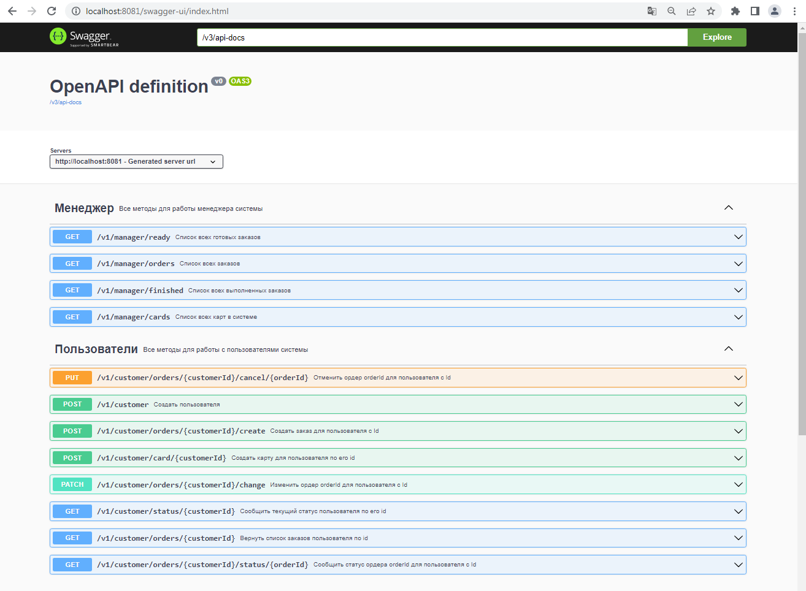

"# job4j-Hungry_Wolf-Order" 
# order
Этот сервис является частью микросервисного приложения по заказу еды Голодный Волк.

## Используемые технологии:


Перед запуском установите:

- PostgreSQL 14
- Java 17
- Apache Maven 3.x

## Запуск приложения

1. Создайте базу данных hungry-wolf-order:
```sql
create database hungry-wolf-order;
```
2. Сервис для работы использует порт 8081.
   Запуск сервиса производится с использованием maven.
   Перейдите в корневой каталог проекта и в командной строке
   выполните команды:
```
    mvn clean install
    mvn spring-boot:run
```
3. При запущенном сервисе доступна документация по адресу:
```
    http://localhost:8081/swagger-ui/index.html   
```
### Описание:

1. Контроллеры для работы:
   